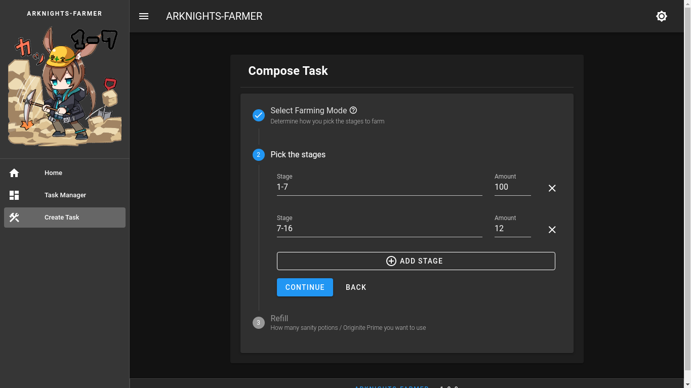

# arknights-farmer

Farming assistant for Arknights.

## Installation

### Prerequisites

* Docker and docker-compose
* Android emulator/device that connects to adb through TCP
* git

### With Docker

Clone this repository using `git clone` command
```sh
$ git clone https://github.com/cytopz/arknights-farmer
$ cd arknights-farmer
```
Switch to `with-webui` branch.
```sh
$ git checkout with-webui
```

Run `docker-compose` command inside the directory.
```sh
$ docker-compose up -d --build --remove-orphans
```
Now the docker containers have started and will autostart every time you boot your machine.

Lastly, add this line into your [hosts file](https://en.wikipedia.org/wiki/Hosts_(file)#Location_in_the_file_system).
```
# arknights-farmer
127.0.0.1 arknights.farmer
```

Now you can go to http://arknights.farmer to see the web interface (Depending on your adblocker, you 
may have to turn it off for this to work properly).

You will be prompted to connect to the adb every time you start the emulator.

To stop the containers you can run this command inside the directory.
```sh
$ docker-compose down
```

## Some Screenshots




## License
Licensed under the MIT License. See `LICENSE` for more information.

## Disclaimer

It has not been clear whether it is safe to use this tool or not. I am not responsible for what happens to your account.

Use at your own risk.
